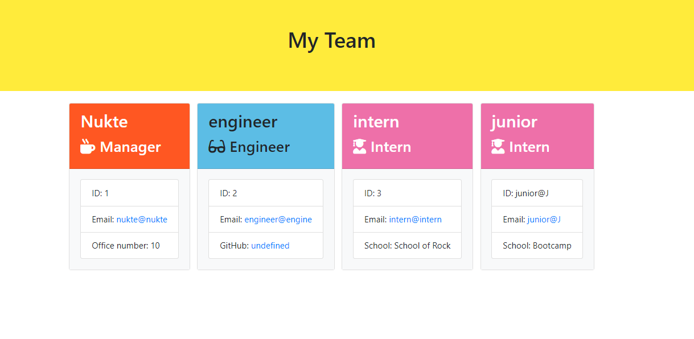
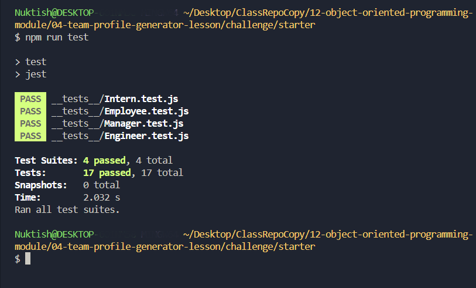

# node-team-render
Generate an HTML web page displaying based on input from the command line.

## Table of Contents
- [Description](#description)
- [Usage](#usage)
- [Screenshots](#screenshots)
- [Tests](#tests)
- [GitHub](#github)
- [License](#license)

## Description
This project is a command-line application that generates professional README files for your projects. It simplifies the process by prompting the user for information about the project and then dynamically creates a README.md file based on the responses.

## Usage
To use the application, follow these steps:

1. Run the command `node index.js`.
2. Follow the prompts to input information about your team members.
3. Once all prompts are completed, the HTML file will be generated in the current directory.

## Screenshots

## Tests

To run the tests, run the command: npm run test

## GitHub
Github: **[Nukte-Y](https://github.com/Nukte-y/node-team-render)**

## License
This project is licensed under the terms of the [MIT License](LICENSE).

